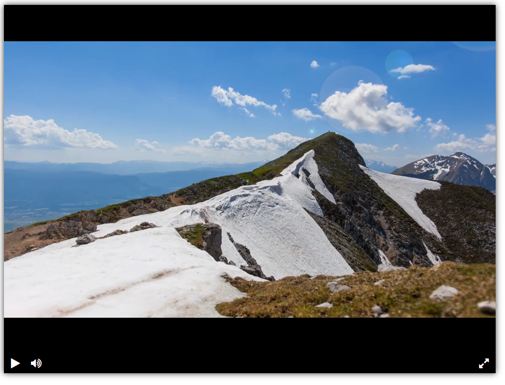
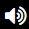
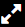

# Видеоплеер

Сайт с видеоплеером.  

## Интерфейс видеоплеера

Чтобы ознакомиться с интерфейсом видеоплеера, перейдите по ссылке: [Смотреть](https://linalleks.github.io/Django-layout-L1/)  
Вы увидите страницу, как на скриншоте:

Видеоплеер оснащен панелью управления с кнопками:
-  — кнопка запуска видео-плеера. После нажатия (запуска видео) автоматически заменяется на кнопку паузы и появляется снова после окончания видео. 
-  — кнопка паузы видео-плеера. После нажатия (остановки видео) автоматически заменяется на кнопку запуска.
-  — кнопка, которая отключает звук плеера. После нажатия (отключения звука) автоматически заменяется на кнопку включения звука.
-  — кнопка, которая включает звук. После нажатия (включения звука) автоматически заменяется на кнопку отлючения звука.
-  — кнопка, которая включает полноэкранный режим. Выйти из данного режима можно с помощью клавиши `Esc` на клавиатуре.

## Код

Видеоплеер свёрстан с помощью [Библиотеки для создания видеоплеера](https://github.com/devmanorg/video-player-jslib)

## Цель проекта

Код написан в образовательных целях на онлайн-курсе для веб-разработчиков [dvmn.org](https://dvmn.org/).
